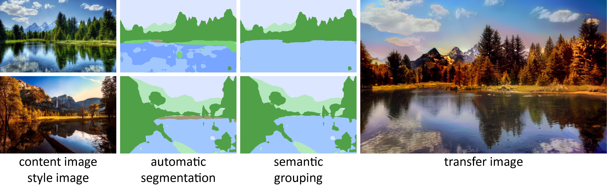

# Automated Deep Photo Style Transfer

This repository holds a TensorFlow implementation for the paper [Automated Deep Photo Style Transfer](https://arxiv.org/abs/1901.03915).

At its core this is a TensorFlow based implementation of the paper [Deep Photo Style Transfer](https://arxiv.org/abs/1703.07511).

One of the main contributions of “Automated Deep Photo Style Transfer” is the automatic segmentation of input images and a semantic grouping thereof. Another contribution of this is the optimization of the transfer image by improving the aesthetics of the image with the use of [Neural Image Assessment (NIMA)](https://arxiv.org/abs/1709.05424).

## Examples

Given a content and style image, automatically a segmentation is created and semantically grouped to produce a transfer image in the size of the content image by using the [Deep Photo Style Transfer](https://arxiv.org/abs/1703.07511):

    

Here are some example results (from left to right are the content image, the resulting transfer image and the style image):

    

## Setup

1. Download or clone repository files to your computer
1. Go into repository folder
1. Install requirements: `pip3 install -r requirements.txt --upgrade`
1. Download the [weights.zip](https://github.com/Spenhouet/automated-deep-photo-style-transfer/releases/latest) from the latest release and unzip it into a new folder `weights` under the project root.

## Acknowledgement

* **Fujun Luan, Sylvain Paris, Eli Shechtman, Kavita Bala** - [Deep Photo Style Transfer](https://arxiv.org/abs/1703.07511)
* **L. Gatys, A. Ecker, M. Bethge** - [Image Style Transfer Using Convolutional Neural Networks](https://pdfs.semanticscholar.org/7568/d13a82f7afa4be79f09c295940e48ec6db89.pdf)	
* **A. Levin, D. Lischinski, Y. Weiss** - [A Closed Form Solution To Natural Image](http://webee.technion.ac.il/people/anat.levin/papers/Matting-Levin-Lischinski-Weiss-CVPR06.pdf) 
* **H. Zhao, J. Shi, X. Qi, X. Wang, J. Jia** - [Pyramid Scene Parsing Network](https://arxiv.org/pdf/1612.01105.pdf)
* **G. Zhu, C. Iglesias** - [Sematch: Semantic Entity Search from Knowledge Graph](http://km.aifb.kit.edu/ws/sumpre2015/paper4.pdf)
* **Y. Li, Z.A. Bandar, D. Mclean** - [An approach for measuring semantic similarity between words 
using multiple information sources](http://ieeexplore.ieee.org/document/1209005/)
* **H. Talebi, P. Milanfar** - [NIMA: Neural Image Assessment](https://arxiv.org/abs/1709.05424)
* **H. Talebi, P. Milanfar** - [Learned Perceptual Image Enhancement](https://arxiv.org/abs/1712.02864)

## Disclaimer

This software is published for academic and non-commercial use only.
